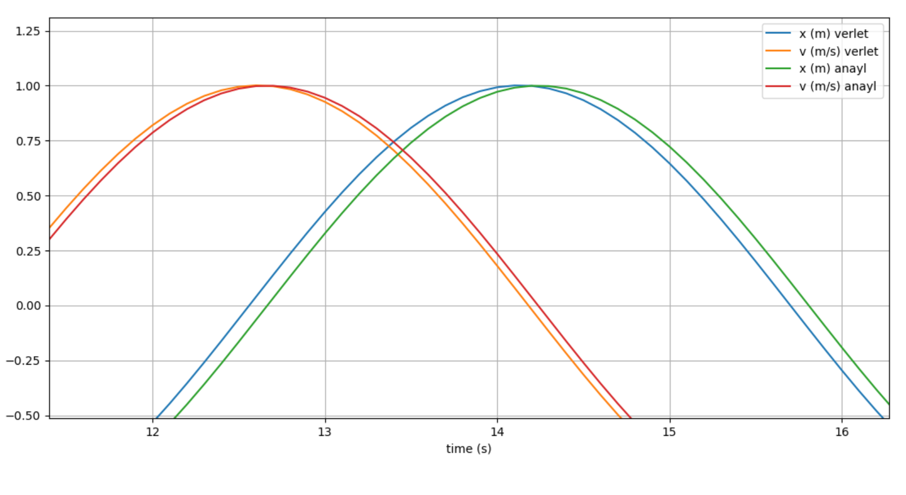
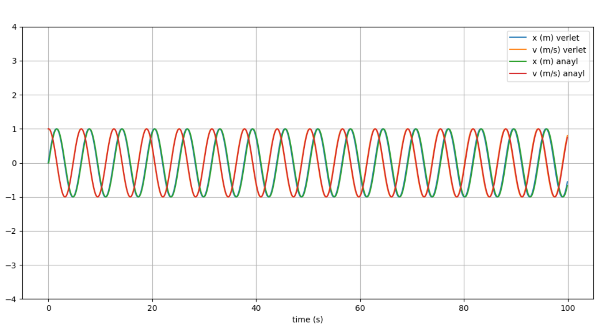
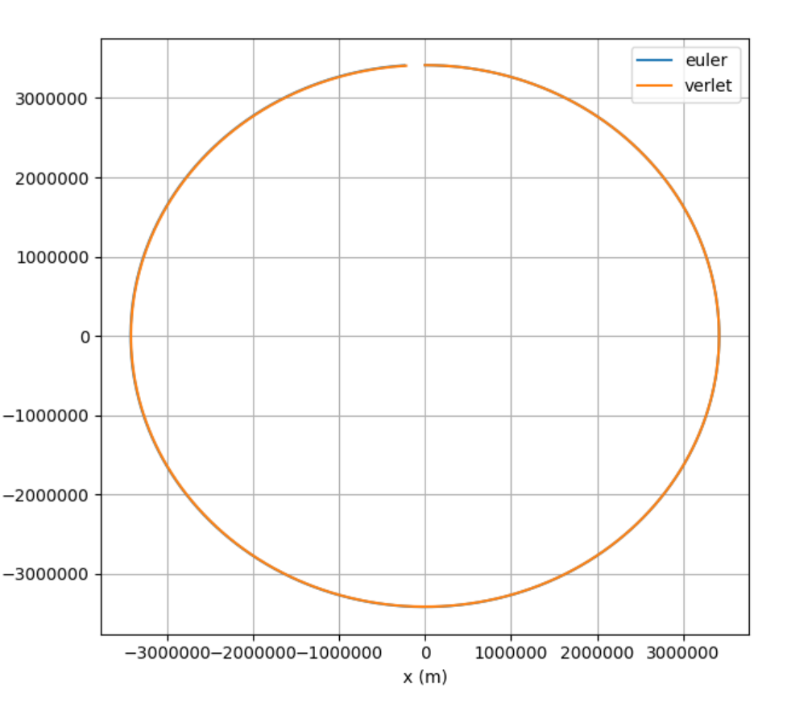
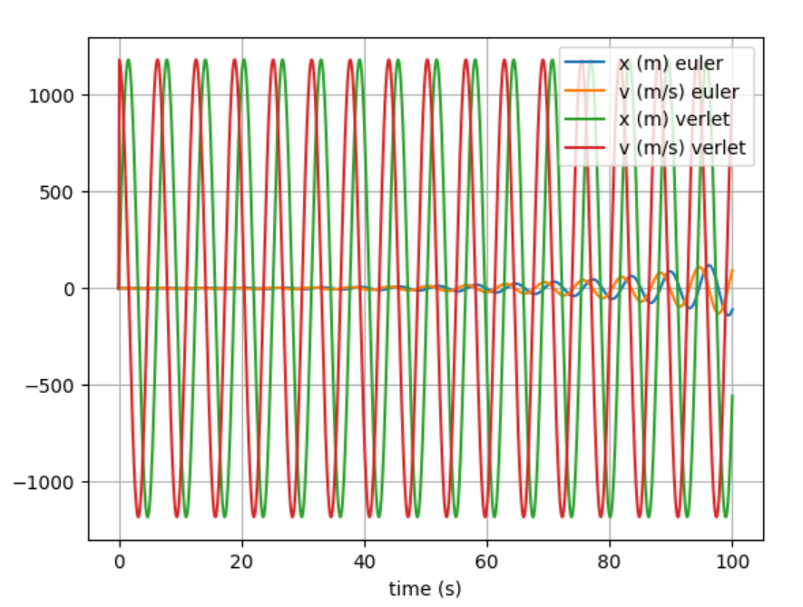

# cued-mars-rover

Repository for my solutions to the CUED Mars Rover Part IA-IB summer project. I gave this less than a day of programming, so the code isn't perfect or performance optimized.

Future plans may be to recreate this using WASM.

## Task 1

## Task 2

# Task 3

